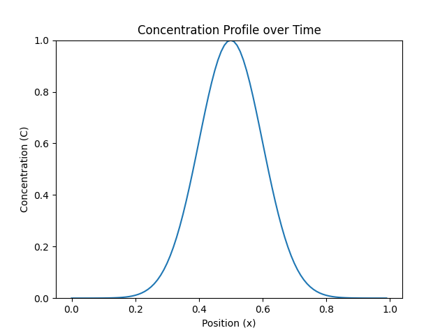
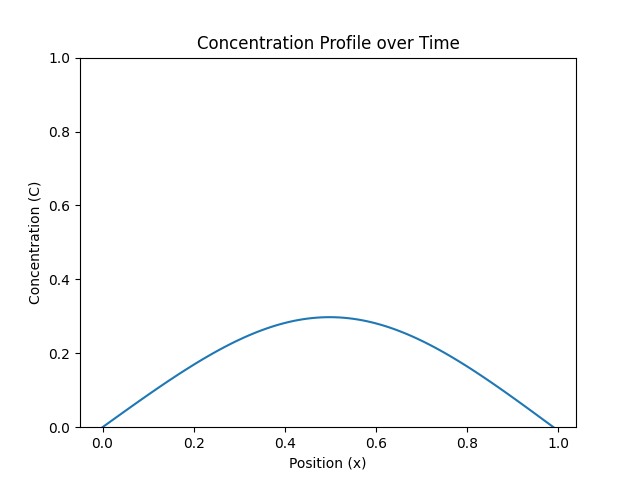

# CHEM 281 Lab 4

## Orientation

Welcome to CHEM 281 Lab 4! In this lab, our focus is primarily on utilizing basic OpenMP constructs. It consists of two parts: 1) a series of small exercises for parallelizing loops using different OpenMP clauses and 2) an opportunity to implement a finite difference integration method for solving Fick's second law of diffusion.

### Goals

The goal of this lab is twofold: first, to practice a bit of OpenMP usage, and second, to allow you to experiment with and visualize the results of Fick's second law, which models diffusion in solids.

## 0. Set up your development environment

A Dockerfile containing all of the tools and dependencies you need for this project is included here.

To build the image, and then open an interactive terminal in the resulting container, use:

```
>>> ./build_image.sh
>>> ./interactive.sh
```

If either of these gives you a permission denied error, use `chmod +x` to make them runnable. For example:

```
>>> chmod +x ./interactive.sh
```

## 1. Build the code and run the ExerciseProfiler to see that parallelization should be done.

This code should run without bugs, but you'll see messages suggesting that parallelization might help for each
of the exercises. Note that it's not necessarily the case the parallelization will help in every one of these cases.

```
mkdir build
cd build
cmake ..
make
./ExerciseProfiler
```

## 2. Parallelize each of these test cases

You can find the implementations to each of these exercises in the `openmp_exercises/src` directory. The files all start with `openmp_exercise`:

```
src ->
    openmp_exercise_1.cpp
    openmp_exercise_2.cpp
    openmp_exercise_3.cpp
    openmp_exercise_4.cpp
    openmp_exercise_5.cpp
```

Use OpenMP to parallelize each of these test cases. You shouldn't really have to change the actual C++ code, just add `#pragma` lines for each case. Note that in each file there are `serial` and `parallel` versions of each function. Don't change the serial ones, they are there for timing reference, and for you to look at in case you need to see what the original implementations looked like. To remind you of the syntax for some of these features:

```
#pragma omp parallel for
#pragma omp parallel for collapse(3)
#pragma omp parallel for reduction(+:sum)
#pragma omp atomic
#pragma omp for private(x)
```

These may all come in handy for different exercises.

## 3. The Finite Difference Method and Fick's Second Law


Fick's Second law is the governing equation for how concentrations of diffusing species evolve in time. This could be used to model the spread of a gas in a vessel, or the spread of metal atoms diffusing into the lattice of a different metal (typically called a diffusion couple). We represent this process in one dimension using a "concentration profile".


Here is an example:



In this plot, the x axis corresponds to a position. The amount of "material", or the concentration, at each x position is given by the y value. In this example, the concentration is spread over a Gaussian in the center of the box. We will also force the end points (the left and rightmost edges of the box) to always be at 0 concentration (imagine that there are "drains" at either edge of the box that force this condition). These are called our "boundary conditions".

If we use this initial profile, and the boundary conditions described above, the material in the box will spread out:


Finally, at an even later time, it will have flattened out more:




[You can read about Fick's second law (and the first law) here.](https://en.wikipedia.org/wiki/Fick%27s_laws_of_diffusion#Fick's_second_law) In this exercise, we will be focusing on experimenting with concentration profiles in a single dimension for simplicity (and so we can easily visualize them).

Some boundary conditions and initial conditions give a form of the equation that can be solved analytically - that is, we can use algebra to come to a formal expression for the solution. In many cases, however, this isn't possible, and we use a numerical method called the "Finite Difference Method" to evolve our system over time.

**In this section you will:**

A. Implement the finite difference update rule\
B. Parallelize the evolution using openmp\
C. Experiment with various boundary conditions and initial settings to produce animations of evolving concentration profiles.

You can find the relevant code in `openmp_exercises/src/diffusion.cpp`

### A. Implementing the Finite Difference method

In the finite difference method we write down a _discretized_ form of Fick's second law, and then use it to get an expression for the concentration at a given position in the next time step.

To implement the finite difference method, you can use the following equation:


- C<sub>i</sub><sup>n+1</sup> - the concentration at position `i` at timestep `n + 1`
- C<sub>i</sub><sup>n</sup> - the concentration at position `i` at the current timestep
- D - the diffusion coefficient
- delta t - the size of the timestep
- delta x - the size of each discretized length section
- C<sub>i-1</sub><sup>n</sup> - the concentration at position `i+1` (to the right one unit) at timestep `n + 1`
- C<sub>i+1</sub><sup>n</sup> - the concentration at position `i` (to the left one unit) at timestep `n + 1`

**INSTRUCTIONS:** Implement this rule on line 96 in `openmp_exercises/src/diffusion.cpp`

To check if this is working, build the code, and run the `FickSolver` executable. This will run the simulation and output two files
- `diffusion.mp4`
- `initial_concentration_profile.png`

Use `diffusion.mp4` to see if you are getting a reasonable answer.

### B. Parallelize the loop

Parallelize the loop that updates concentration profiles (the same one where you just implemented the rule).

### C. Experiment with various concentration profiles

Look at the top of the `openmp_exercises/src/diffusion.cpp` file. Several sections are highlighted for you to change:
- The simulation parameters (D, dx etc)
- The boundary conditions
- The initial concentration profile (The initial values of the C[] array)


